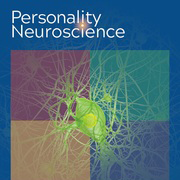

## About me

I study how we navigate the great blooming buzzing confusion of the social world.

Misadventurer; reluctant optimist; amor fati.

My name is 손재영. In English, I go by Jae. Learn more about Korean naming conventions [here](https://en.wikipedia.org/wiki/Korean_name). Hear how my full name is pronounced [here](https://translate.google.com/?sl=kr&tl=en&text=%EC%86%90%EC%9E%AC%EC%98%81&op=translate).

```{r echo=FALSE}
htmltools::p(
  "
  \"One-dimensional thought is systematically promoted by the makers of politics and their purveyors of mass information.
  Their universe of discourse is populated by self-validating hypotheses which, incessantly and monopolistically repeated,
  become hypnotic definitions or dictations.\" -Herbert Marcuse.
  ",
  style = "font-size: 80%; font-style: italic"
)
```

&nbsp;  

## Publications

An index of my publications can also be found on [**Google Scholar**](https://scholar.google.com/citations?user=JPPuzI8AAAAJ).

::::: {#publications .publication-grid}

::: {#epe21}
```{r, echo=FALSE, out.width="150px"}
knitr::include_graphics("./papers/EPE_NHB_2021.png")
```
:::

::: {#epe21}
Heffner, J., **Son, J.**, & FeldmanHall, O. (2021). Emotion prediction errors guide socially adaptive behaviour. *Nature Human Behaviour.*  
[**Online**](https://www.nature.com/articles/s41562-021-01213-6) |
[**PDF**](https://jaeyoungson.com/papers/EPE_NHB_2021.pdf) |
[**Data & Code**](https://github.com/jpheffne/epe)
:::


::: {#cogmap21}
```{r, echo=FALSE, out.width="150px"}
knitr::include_graphics("./papers/CogMaps_PNAS_2021.png")
```
:::

::: {#cogmap21}
**Son, J.**, Bhandari, A., & FeldmanHall, O. (2021). Cognitive maps of social features enable flexible inference in social networks. *Proceedings of the National Academy of Sciences*.  
[**Online**](https://www.pnas.org/content/118/39/e2021699118) |
[**PDF**](https://jaeyoungson.com/papers/CogMaps_PNAS_2021.pdf) |
[**Data & Code**](https://osf.io/v8ucz/)
:::


::: {#conform19}
```{r, echo=FALSE, out.width="150px"}
knitr::include_graphics("./papers/CrowdsourcingPunishment_SciRep_2019.png")
```
:::

::: {#conform19}
**Son, J.**, Bhandari, A., & FeldmanHall, O. (2019). Crowdsourcing punishment: Individuals reference group preferences to inform their own punitive decisions. *Scientific Reports.*  
[**Online (Open Access)**](https://www.nature.com/articles/s41598-019-48050-2) |
[**PDF**](https://jaeyoungson.com/papers/CrowdsourcingPunishment_SciRep_2019.pdf) |
[**Data & Code**](https://osf.io/8ka47/)
:::


::: {#norms18}
```{r, echo=FALSE, out.width="150px"}

```
:::

::: {#norms18}
FeldmanHall, O., **Son, J.**, & Heffner, J. (2018). Norms and the flexibility of moral action. *Personality Neuroscience.*  
[**Online (Open Access)**](https://www.cambridge.org/core/journals/personality-neuroscience/article/norms-and-the-flexibility-of-moral-action/A8A5140A517ECEE314A21FF9FE0E9EED) |
[**PDF**](https://jaeyoungson.com/papers/NormsMoralAction_PN_2018.pdf)
:::

:::::

```{r echo=FALSE}
htmltools::p(
  "
  Disclaimer: The PDFs provided may be copyrighted by the journals/edited volumes
  in which they are published. Access to these articles is provided to facilitate
  timely distribution of scientific knowledge, and is therefore intended for your
  personal use only. No commercial use may be made of these articles, nor is mass
  production of these articles permitted.
  ",
  style = "font-size: 70%; font-style: italic"
)
```

&nbsp;  

## Unpublished work

::::: {#publications .publication-grid}

::: {#emocomm}
```{r, echo=FALSE, out.width="150px"}
knitr::include_graphics("./papers/EmoComm.png")
```
:::

::: {#emocomm}
Williams, W.C., Leong, Y.C., Collier, E.A., Nook, E.C., **Son, J.**, & Zaki, J. (preprint). Communicating emotion through facial expressions: Social consequences and neural correlates. *PsyArXiv.*  
[**Online (preprint)**](https://psyarxiv.com/4zpfk/)
:::

:::::

